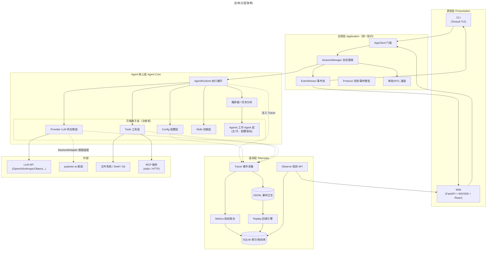

# Mira Code — Coding Agent 平台设计文档

> 状态：设计稿 v0.3（Agent 编排 / MCP / 多会话并发细化，Open Questions 已收敛）
> 技术栈：Python
> 框架策略：基于 pydantic-ai 封装（BackendAdapter 适配器，单一后端）
> 表现层：CLI 用 Textual（TUI），Web 用 React
> 遥测存储：JSONL 事件日志（主存储 + 回放源） + SQLite（索引 / 指标 / 观测） + 报告文件目录

本文档是平台设计的**总览与入口**。各层详细设计已拆分为独立文档（见下表），整体按**单向依赖**组织：

```
表现层 → 应用层 → Agent 核心层 →（横切）遥测层
```

## 文档索引

| 文档 | 内容 |
| --- | --- |
| [presentation.md](presentation.md) | **表现层**：CLI（Textual）/ Web（React） |
| [web-ui.md](web-ui.md) | Web 界面：页面清单与布局（核心页 / 规划页） |
| [application-layer.md](application-layer.md) | **应用层**：统一契约 / 会话管理 / EventStream / 审批 / 多会话并发隔离 |
| [core-agent-layer.md](core-agent-layer.md) | **Agent 核心层**：Runtime / Config / Provider / Tools / MCP / Skills / Agents / 编排分派 |
| [telemetry.md](telemetry.md) | **遥测层**：Tracer / 存储 / 指标 / 回放 / 观测 |
| [data-models.md](data-models.md) | 核心数据模型、遥测事件 taxonomy、指标口径 |
| [flows.md](flows.md) | 关键流程时序图（端到端 / 分派 / 遥测） |
| [directory-structure.md](directory-structure.md) | 目录结构建议 |
| [config-examples.md](config-examples.md) | 配置示例（mira / agents / mcp / providers） |
| [planning.md](planning.md) | 扩展点 / 里程碑 / 决策记录与剩余 Open Questions |
| [implementation-plan.md](implementation-plan.md) | **实现阶段计划**：P0–P5 分阶段排期与验收 |

## 项目概述与目标

构建一个 **coding agent 平台**，同一套 agent 核心能力同时支撑两种交互界面：

| 交互形态 | 说明 |
| --- | --- |
| **Web** | 起一个 web server，浏览器内与 coding agent 交互，含实时流式输出、会话管理、观测面板 |
| **CLI** | 终端内的交互式界面（REPL 或单次执行），复用同一套核心 |

**核心诉求：**

1. **表现层与核心层解耦** —— CLI 与 Web 只负责"展示 + 输入交互"，所有 agent 逻辑收敛在核心层，避免两套实现漂移。
2. **核心层分层清晰** —— agent 配置、LLM provider 配置、tool、skill、工作 agent 各自独立成层，可插拔、可扩展。
3. **遥测内建** —— 对 agent 的各类操作与指标进行全量监控，支持**回放（replay）**与**观测（observe）**，作为调试与质量保障的基础设施。
4. **多会话并发** —— 同一工作区可同时开多个会话并行工作，用户来回切换查看；后端带全局并发上限。

### 设计目标（验收标准）

- [ ] 同一份 agent 核心代码，CLI 与 Web 均能驱动，且行为一致（同一事件流协议）。
- [ ] 新增一个 LLM provider / tool / skill / 工作 agent，只改对应子层，不动其他层。
- [ ] 新增 agent（主/子）只需写配置（system prompt + skill + MCP + tools），无需写代码。
- [ ] 主 agent 可按需分派子任务（调查/原型验证/检索），子 agent 结构化汇报、主 agent 汇总决策。
- [ ] 同一工作区可开多个会话并行工作，用户来回切换查看；后端有全局并发上限。
- [ ] 任意一次 agent 运行均可从遥测日志完整回放（历史数据重放，不重新发请求），输出与实时一致。
- [ ] 遥测采集对核心逻辑零侵入（通过注入式 Tracer 接口，不硬编码）。

## 设计原则

1. **单向依赖**：表现层 → 应用层 → Agent 核心层 → 子层（Config/Provider/Tools/Skills/Agents）。核心层**不反向依赖**表现层。
2. **依赖倒置**：核心层依赖 `Tracer` 抽象接口采集遥测，由上层/装配层注入具体实现（JSONL / 指标 / 测试桩）。
3. **事件即事实（Event Sourcing）**：agent 的一切关键动作都产出结构化事件；消息、工具调用、LLM 往返均为可回放的事件流，而非散落的日志。
4. **注册表 + 适配器**：Provider、Tool、Skill、Agent 全部走注册表；LLM 与现有框架通过适配器封装，核心接口稳定。
5. **配置分层覆盖**：内置默认 → 项目配置 → 用户级配置 → 环境变量/命令行，逐层覆盖。
6. **可观测性是第一等公民**：所有层均可被 Tracer 采集，指标（延迟/Token/成本/错误率）自动聚合。

## 总体架构



### 一次请求的职责划分

| 层 | 职责 | 禁止做的事 |
| --- | --- | --- |
| 表现层 | 渲染事件流、收集用户输入、展示会话/观测 | 不得直接调 LLM、不得执行 tool、不得访问遥测存储 |
| 应用层 | 会话生命周期、事件路由、审批流转、协议转换 | 不得包含 agent 决策逻辑 |
| Agent 核心层 | 执行循环、上下文组装、tool/skill/provider 编排 | 不得依赖具体 UI 或具体存储实现 |
| 遥测层 | 事件落盘、指标聚合、回放、观测查询 | 不参与 agent 决策 |

## 阅读指引

按顺序阅读可快速建立整体认识：

1. 先看本页（总览 + 架构 + 原则）。
2. 依次读表现层 → 应用层 → Agent 核心层（了解各层职责与边界）。
3. 读遥测层与数据模型（了解事件与可观测性）。
4. 需要落地时参考目录结构、配置示例与 flows；规划节奏看 planning。
