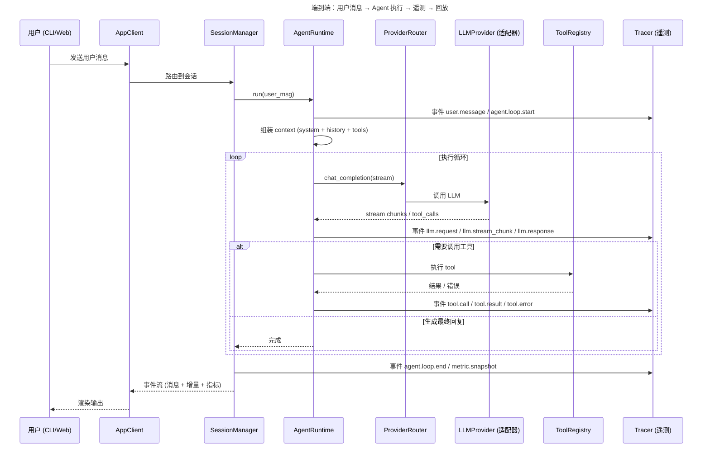
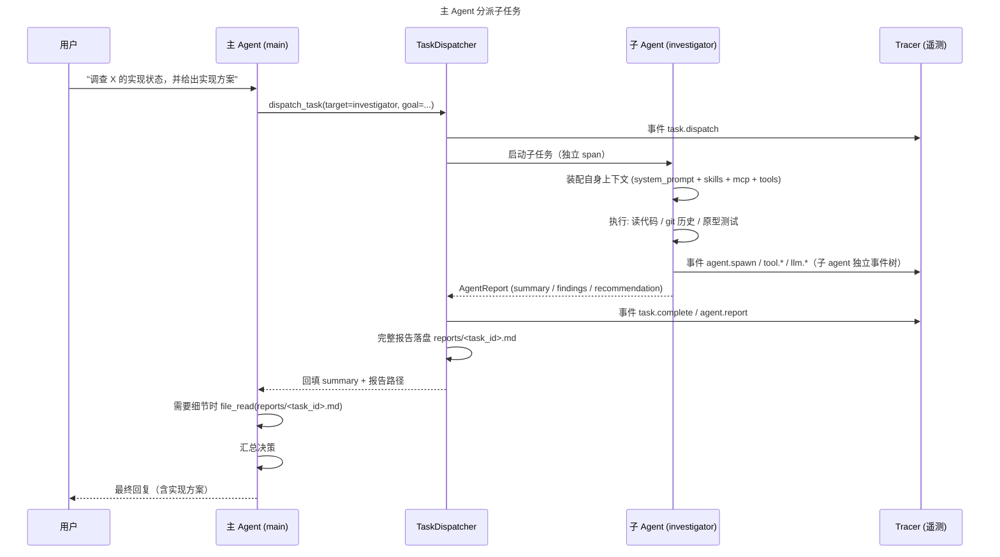
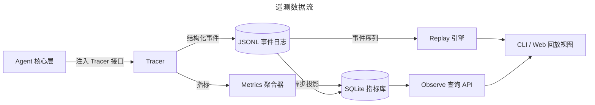

# 关键流程（时序）

> 所属项目：[Mira Code 设计文档](README.md) ｜ 相关：[应用层](application-layer.md)、[Agent 核心层](core-agent-layer.md)、[遥测层](telemetry.md)

## 6.1 一次 agent 运行的端到端时序

## 6.2 主 Agent 分派子任务（调查 → 汇报 → 汇总）

## 6.3 遥测：从采集到回放

