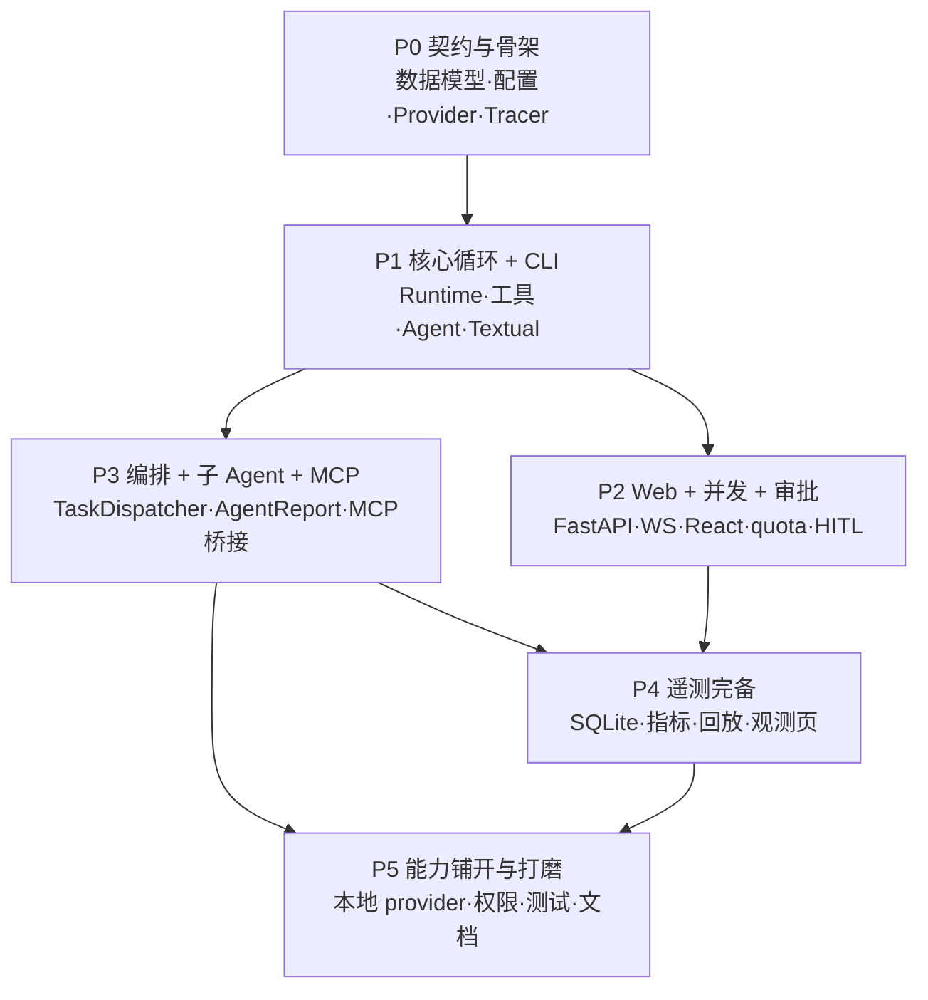

# 实现阶段计划（Implementation Plan）

> 所属项目：[Mira Code 设计文档](README.md) ｜ 里程碑与决策记录见 [planning.md](planning.md)
> 原则：**每阶段可独立运行、可验收**；先纵向打通，再横向铺开；**mock provider 常驻**，保证无 LLM 环境也能验证。

## 数据存储布局（~/.mira-code/）

> 设计文档正式记录见 [directory-structure.md](directory-structure.md)；本节约为实现阶段的落点说明。

所有运行数据统一收口到 `~/.mira-code/`（可用环境变量 `MIRA_HOME` 重定向，测试用），按 workspace 分层；统一入口见 `mira/paths.py`：

```text
~/.mira-code/
├── configs/                        # 全局配置文件（根目录级）
└── workspaces/                     # workspace 层
    └── <文件夹名>_<全路径哈希>/       #   每个 workspace（如 workspace_123hxs1）
        ├── sessions/               #   session 层
        │   └── <session_hashcode>/  #     每个 session（id = hashcode）
        │       ├── session_id.jsonl #       会话事件日志 / 回放源
        │       └── reports/         #       子 agent 完整报告 <task_id>.md
        └── telemetry/              #   workspace 级遥测
            └── mira.db             #     SQLite 索引 / 指标（P4）
```

- 全局配置文件首次运行从内置 `configs/` 播种到 `~/.mira-code/configs/`（`seed_global_config`）。
- 配置分层：内置默认（`configs/`）→ 全局（`~/.mira-code/configs/`）→ 可选层 → 环境变量覆盖。
- 会话事件日志存放于 `~/.mira-code/workspaces/<ws>/sessions/<session_id>/session_id.jsonl`；子 agent 完整报告在 `sessions/<session_id>/reports/`。

## 代码文件树（含文件作用）

> 与实现同步维护：**新增 / 删除 / 重命名文件时，请同步更新本树**。每个文件右侧注明其职责。

```text
mira-code/
├── pyproject.toml                    # uv 工程：依赖 / 脚本入口（mira = mira.cli.app:main）
├── uv.lock                           # 依赖锁定文件
├── configs/                          # 内置默认配置（首启播种到 ~/.mira-code/configs/）
│   ├── mira.toml                     #   运行时默认（telemetry / session / quota / approval）
│   ├── providers.toml                #   LLM 供应商定义（type = litellm 前缀，决策 #24）
│   ├── models-dev.json               #   models.dev 快照（供应商/模型/thinking 目录，决策 #24）
│   ├── mcp.toml                      #   MCP server 定义（stdio / http，决策 #8a）
│   ├── skills.toml                   #   技能全局定义
│   └── agents/                       #   agent 定义（配置即注册）
│       ├── main.toml                 #     主 agent（dispatch=auto，可分派子任务）
│       ├── investigator.toml         #     子 agent：实现调查（只读）
│       ├── proto_tester.toml         #     子 agent：原型验证
│       └── summarizer.toml           #     会话标题生成 agent
├── mira/                             # 核心包
│   ├── __init__.py
│   ├── paths.py                      #   数据布局唯一真相源（~/.mira-code/ 路径计算）
│   ├── util.py                       #   工具：new_id / short_hash / new_session_id / count_tokens
│   ├── api/                          #   应用层（CLI 与 Web 共用门面）
│   │   ├── protocol.py               #     统一契约（Session/Message/ToolCall/TaskSpec/AgentReport）
│   │   ├── stream.py                 #     EventStream：线程安全事件流（seq 有序，快照/增量）
│   │   ├── session.py                #     SessionManager：会话生命周期 + 编排 / MCP 接线
│   │   ├── quota.py                  #     并发配额（max_concurrent_sessions）
│   │   ├── approval.py               #     审批通道（HITL：allow / deny / always）
│   │   └── client.py                 #     AppClient：CLI 与 Web 的统一门面
│   ├── core/                         #   核心层
│   │   ├── runtime.py                #     AgentRuntime：agent 执行循环（LLM↔工具↔编排）
│   │   ├── context.py                #     上下文组装 + token 预算（build_context）
│   │   ├── orchestration.py          #     P3 TaskDispatcher：子任务分派与汇报
│   │   ├── agents/                   #     agent 运行时
│   │   │   ├── base.py               #       BaseAgent：由 AgentConfig 生成
│   │   │   └── registry.py           #       AgentRegistry：配置即注册
│   │   ├── config/                   #     配置层
│   │   │   ├── schemas.py            #       pydantic 配置 schema（运行时校验）
│   │   │   ├── store.py              #       ConfigStore：分层加载 + 首启播种
│   │   │   ├── loader.py             #       TOML 读取 / 深合并 / env 覆盖
│   │   │   ├── queries.py            #       配置中心读取：get_config / get_models（决策 #10）
│   │   │   └── mutation.py           #       配置中心写回：校验 + TOML 落盘 + 失效（决策 #10）
│   │   ├── providers/                #     LLM 供应商抽象（决策 #24：统一 litellm）
│   │   │   ├── base.py               #       LLMProvider ABC / StreamChunk / Usage / ChatMessage / ModelInfo
│   │   │   ├── litellm.py            #       LiteLLMProvider：统一走 litellm（含 reasoning_effort）
│   │   │   ├── catalog.py            #       ModelCatalog：models.dev 快照（供应商/模型/effort）
│   │   │   ├── mock.py               #       MockProvider（无 LLM 可跑，驱动工具循环）
│   │   │   ├── router.py             #       ProviderRouter：路由 / 重试退避 / 构建 / 模型聚合
│   │   │   └── framework/            #       框架适配器（决策 #1 收敛点）
│   │   │       ├── base.py           #         BackendAdapter 抽象
│   │   │       └── pydantic_ai.py    #         pydantic-ai 后端适配器（占位）
│   │   ├── tools/                    #     工具层
│   │   │   ├── base.py               #       Tool ABC / ToolContext / ToolResult（含截断）
│   │   │   ├── registry.py           #       ToolRegistry（注册 / 查找 / 按 agent 过滤）
│   │   │   ├── permission.py         #       PermissionChecker（allow / ask / deny）
│   │   │   └── builtin/              #       内建工具
│   │   │       ├── shell.py          #         shell 命令执行
│   │   │       ├── file_tools.py     #         file_read / write / edit
│   │   │       ├── search.py         #         search_grep 文本检索
│   │   │       └── dispatch.py       #         P3 dispatch_task（分派子任务）
│   │   ├── skills/                   #     技能层
│   │   │   ├── base.py               #       Skill 数据模型
│   │   │   ├── registry.py           #       SkillRegistry（注册 / 查找 / 枚举）
│   │   │   └── loader.py             #       SkillLoader：注册表 + system prompt 组合
│   │   └── mcp/                      #     P3 MCP 桥接（决策 #8a–8d）
│   │       ├── base.py               #       McpTransport 抽象 / McpError
│   │       ├── transports.py         #       stdio / http 传输实现（JSON-RPC 2.0）
│   │       ├── bridge.py             #       McpTool：包装 MCP 工具为内建 Tool
│   │       └── manager.py            #       McpManager：每会话连接 / 释放
│   ├── telemetry/                    #   遥测层
│   │   ├── events.py                 #     事件 taxonomy + 统一信封（Event / EventType）
│   │   ├── tracer.py                 #     Tracer：注入式采集 + span 上下文（零侵入）
│   │   ├── store.py                  #     EventStore：JSONL 落盘 / 读取（回放源）
│   │   └── reports.py                #     P3 子 agent 完整报告落盘（reports/<task_id>.md）
│   ├── cli/                          #   CLI（Textual + REPL）
│   │   ├── app.py                    #     mira 命令入口（参数解析）
│   │   ├── repl.py                   #     交互式 REPL（事件流渲染）
│   │   └── widgets.py                #     Textual TUI 组件
│   └── web/                          #   Web（FastAPI + React SPA）
│       ├── server.py                 #     FastAPI 应用工厂 + uvicorn 入口（--port）
│       ├── ws.py                     #     WebSocket 事件透传（last_seq 增量 + 重连补偿）
│       ├── router/                   #     REST 路由（按职责拆分，经 AppClient 调核心）
│       │   ├── __init__.py           #       聚合各子路由
│       │   ├── models.py             #       请求体模型
│       │   ├── system.py             #       /health /meta /quota
│       │   ├── config.py             #       配置中心（读写经 AppClient → core/config）
│       │   ├── workspaces.py         #       工作区列表 / 重命名 / 删除
│       │   ├── sessions.py           #       会话 CRUD + 消息
│       │   ├── approvals.py          #       审批（HITL）
│       │   └── events.py             #       观测事件快照
│       └── webui/                    #     前端（React 无构建，CDN + Babel 编译）
│           ├── index.html            #       页面骨架
│           ├── app.js                #       React 组件（侧边栏 / 输入栏 / 消息流 / 弹窗）
│           └── style.css             #       样式（对齐 mockups/workspace.html）
├── tests/                            # 测试
│   ├── conftest.py                   #   MIRA_HOME 隔离 + 默认关闭真实 MCP 连接
│   ├── fixtures/
│   │   └── mcp_echo_server.py        #   mock MCP stdio server（P3 测试用）
│   ├── unit/                         #   单元测试（P0–P3 各模块）
│   │   ├── test_protocol.py          #     契约模型（Session / TaskSpec / AgentReport）
│   │   ├── test_events.py            #     事件信封 / taxonomy
│   │   ├── test_config.py            #     配置 schema 与分层加载
│   │   ├── test_paths.py             #     数据布局路径计算
│   │   ├── test_providers.py         #     Mock / Router / 重试
│   │   ├── test_telemetry.py         #     Tracer / EventStore 落盘
│   │   ├── test_tools.py             #     内建工具 + 权限判定
│   │   ├── test_runtime.py           #     AgentRuntime 执行循环
│   │   ├── test_session.py           #     SessionManager / EventStream / 客户端流
│   │   ├── test_quota.py             #     并发配额
│   │   ├── test_approval.py          #     审批通道
│   │   ├── test_reports.py           #     P3 报告落盘
│   │   ├── test_mcp.py               #     P3 MCP 桥接（stdio / 注册表 / 容错）
│   │   ├── test_orchestration.py     #     P3 编排（分派 / span 树 / 隔离）
│   │   ├── test_config_mutation.py   #     配置中心读写（core/config：queries / mutation）
│   │   ├── test_p0_acceptance.py     #     P0 验收
│   │   └── test_p1_acceptance.py     #     P1 验收（工具循环 / 事件落盘）
│   └── integration/
│       └── test_web.py               #   Web 集成（REST + WS + 会话标题）
├── mockups/                          # 设计 mockup
│   ├── workspace.html                #   会话工作区 / 配置中心（v5）
│   └── observe.html                  #   观测页
└── docs/                             # 设计文档
    ├── README.md                     #   项目总览
    ├── planning.md                   #   里程碑 / 决策记录（#1–#23）
    ├── implementation-plan.md        #   实现阶段计划（本文档）
    ├── directory-structure.md        #   数据布局规范
    ├── data-models.md                #   数据模型 / 事件 taxonomy / 指标口径
    ├── core-agent-layer.md           #   核心 agent 层
    ├── application-layer.md          #   应用层（多会话并发 / 审批）
    ├── config-examples.md            #   配置示例
    ├── flows.md                      #   交互流程
    ├── telemetry.md                  #   遥测设计
    ├── presentation.md               #   表现层规范
    └── web-ui.md                     #   Web UI 设计
```

## 阶段总览

| 阶段 | 名称 | 等价里程碑 | 状态 | 一句话目标 |
| --- | --- | --- | --- | --- |
| P0 | 契约与骨架 | M0 | ✅ 完成 | 搭好脚手架与全部契约，无 LLM 跑通「一次调用 → 一条 JSONL 事件」 |
| P1 | 核心循环 + CLI | M1 | ✅ 完成 | AgentRuntime 真正驱动 agent，CLI 完成真实任务并落盘事件 |
| P2 | Web + 多会话并发 + 审批 | M2 | ✅ 完成 | 双端行为一致；多会话并行；HITL 审批通道 |
| P3 | 编排 + 子 Agent + MCP | M4 核心 + 部分 M3 | ✅ 完成 | 主 agent 自动分派子任务；MCP 作为外部工具源 |
| P4 | 遥测完备 | M3 收尾 | 任意会话可回放；观测面板出指标 |
| P5 | 能力铺开与打磨 | 收尾 | 补全横向能力与边界场景 |



---

## P0 · 契约与骨架（≈ M0）

**目标**：搭好脚手架与全部契约，在**无 LLM** 的情况下跑通「一次调用 → 一条 JSONL 事件」。

### 范围（文件）

| 子项 | 文件 |
| --- | --- |
| 脚手架 | `pyproject.toml`（uv）、`mira/` 包结构、`tests/` 目录 |
| 数据模型 | `api/protocol.py`（Session / Message / ToolCall / SkillUse / TaskSpec / AgentReport）、`telemetry/events.py`（事件 taxonomy + 统一信封） |
| 配置层 | `core/config/{schemas,store,loader}.py` + `configs/{mira,providers,mcp}.toml` + `configs/agents/*.toml`（分层加载：内置默认 → 项目 → 用户 → env） |
| Provider 抽象 | `core/providers/{base,router}.py` + `core/providers/framework/base.py`（BackendAdapter）+ `openai.py` + `mock.py` |
| 遥测骨架 | `telemetry/{tracer,store}.py`（Tracer 接口 + EventLogTracer + JSONL 落盘） |

### 验收标准

- [ ] 单测通过（配置校验、事件信封、Tracer 落盘）。
- [ ] 用 mock provider 跑一次无工具 LLM 调用，产出含 `span_id / parent_span_id` 的 JSONL 事件文件。
- [ ] 配置分层覆盖生效（env 覆盖项目默认）。

### 依赖 / 注意

- 事件信封字段与 taxonomy 以 [data-models.md](data-models.md) 为准，后续阶段不得破坏该契约。
- Provider 抽象先定接口，pydantic-ai 适配器可后置（决策 #1 的收敛点在 `framework/`）。

---

## P1 · 核心循环 + CLI（≈ M1，纵向打通）

**目标**：AgentRuntime 真正驱动 agent，CLI 能完成真实任务并落盘。

### 范围（文件）

| 子项 | 文件 |
| --- | --- |
| 运行时 | `core/runtime.py`（执行循环）+ `core/context.py`（上下文组装 / token 预算） |
| 工具层 | `core/tools/{base,registry,permission}.py` + `core/tools/builtin/{shell,file,search}.py`（allow / ask / deny） |
| 技能层 | `core/skills/{base,registry,loader}.py` |
| Agent 层 | `core/agents/{base,registry}.py`（配置即注册，先支持 `main`） |
| 应用层基础 | `api/stream.py`（EventStream）+ 基础会话管理 |
| CLI | `cli/{app,repl,widgets}.py`（Textual TUI + REPL：流式 token、工具卡片、状态栏） |

### 验收标准

- [x] CLI 能完成「让它改个文件」任务（shell / file 工具），并落盘 JSONL 事件。
- [x] 无 LLM 时用 mock provider 也可跑通（工具循环可被 mock 输出触发）。
- [x] 工具调用产出 `tool.call / tool.result / tool.error` 事件，含耗时。

### 依赖 / 注意

- EventStream 是 CLI 与未来 Web 的共同契约，事件按 `seq` 有序。
- 权限模型先实现判定函数，审批通道的阻塞语义放到 P2。

---

## P2 · Web + 多会话并发 + 审批（≈ M2）

**目标**：双端行为一致；多会话并行；HITL 审批通道。

### 范围（文件）

| 子项 | 文件 |
| --- | --- |
| 应用层完整 | `api/{session,quota,approval}.py`（SessionManager 隔离 + `max_concurrent_sessions` 配额 + 审批） |
| Web 后端 | `web/{server,ws,routes}.py`（FastAPI + REST + WS 逐事件透传 + 断线按 `last_seq` 补发） |
| Web 前端 | `web/webui/`（React SPA：侧边栏工作区树 + 消息流 + 悬浮输入 + 工具卡片 + 配置中心视图，对齐 `mockups/workspace.html`） |

### 验收标准

- [x] 浏览器与 CLI 完成同一任务，事件流同构、行为一致（验收目标 #1）。
- [x] 多会话并行运行、可来回切换实时查看；超配额排队 / 拒绝。
- [x] 审批弹窗 allow / deny / always，对应 `approval.requested` / `approval.resolved`。

### 依赖 / 注意

- 会话在独立线程运行 agent 循环（决策 #4），共享只读工作区文件系统。
- Web 仅把同一 EventStream 序列化透传，不做业务逻辑（表现层约束）。

---

## P3 · 编排 + 子 Agent + MCP（M4 核心 + 部分 M3）

**目标**：主 agent 自动分派子任务、结构化汇报、MCP 作为外部工具源。

### 范围（文件）

| 子项 | 文件 |
| --- | --- |
| 编排 | `core/orchestration.py`（TaskDispatcher）+ 内建 `dispatch_task` 工具 |
| 子 Agent | `configs/agents/{investigator,proto_tester}.toml`（调查 / 原型验证，配置即注册） |
| 报告 | `telemetry/reports.py`（AgentReport 落盘 `sessions/<session_id>/reports/<task_id>.md` + 只回填 summary，决策 #7 / #9） |
| MCP | `core/mcp/{base,bridge,manager,transports}.py`（stdio / http 工具桥接进 ToolRegistry，统一权限与遥测，决策 #8a–8d） |

### 验收标准

- [x] 主 agent 收到任务 → 自动分派 investigator / proto-tester → 汇总给用户（验收目标 #4）。
- [x] 分派产生独立 span，构成 `main → task.dispatch → agent.spawn …` 可观测树。
- [x] 完整报告可按路径经通用 `file_read` 读取（不新增专用工具）。
- [x] MCP server 暴露的工具与内建工具共用注册表 / 权限 / 遥测。

### 依赖 / 注意

- 子 agent 上下文完全隔离，不污染主 agent 上下文。
- MCP 连接按会话独立创建 / 释放（决策 #8d）。

---

## P4 · 遥测完备：观测 / 回放 / 指标（≈ M3 收尾）

**目标**：任意会话可回放、观测面板出指标图表。

### 范围（文件）

| 子项 | 文件 |
| --- | --- |
| 遥测 | `telemetry/{db,metrics,replay}.py`（SQLite 投影、指标聚合、ReplayEngine 历史重放） |
| 观测 | `telemetry/observe.py` + 观测页（对齐 `mockups/observe.html`：会话列表 + 事件时间线 + 分派 span 树） |

### 验收标准

- [ ] 任意历史会话可完整回放（**不重发** LLM / 工具请求，决策 #5），输出与实时一致（验收目标 #6）。
- [ ] 观测面板展示延迟 / Token / 成本 / 错误率图表（指标口径见 [data-models.md](data-models.md)）。
- [ ] 遥测采集对核心逻辑零侵入（注入式 Tracer，验收目标 #7）。

### 依赖 / 注意

- SQLite 由 JSONL 事件**异步投影**，JSONL 仍是主存储与回放源。
- 成本记账基于服务商 usage 响应，不做估算（决策 #6）。

---

## P5 · 能力铺开与打磨

**目标**：补全横向能力与边界场景。

| 子项 | 说明 |
| --- | --- |
| 本地 provider | Ollama / vLLM 适配 + ProviderRouter 重试 / 限流 / 成本记账 |
| 权限与审批细化 | 多会话审批路由 / 全局审批队列（Open Question #1） |
| 会话体验 | 切换快照粒度（#2）、报告保留策略（#3）、MCP 连接配额估算（#4） |
| 质量与文档 | 回放一致性测试（`tests/replay/`）、指标口径对齐、文档收尾 |

**验收标准**

- [ ] 新增 provider / tool / skill / agent 只改对应子层（验收目标 #2 / #3）。
- [ ] `tests/replay/` 证明回放与实时输出一致。

---

## 阶段排期调整说明（与 planning.md 里程碑的差异）

1. **MCP 放到 P3 而非 P1**：设计 M1 含「MCP 接入」，但为保证每阶段可验收，先用内建工具打通闭环，再接入外部工具源，避免 P1 依赖 npx / 网络。
2. **报告落盘放在 P3**（与分派一起）而非 P4：`AgentReport` 是分派的产出，两者需同阶段实现。
3. **观测页在 P4**：对应 `mockups/observe.html`，依赖 SQLite 投影与指标，放 M3 收尾更合理。
4. **mock provider 常驻**：每个阶段都以「无 LLM 也能跑」为默认前提，便于随时验证与 CI。

## 每阶段默认验证方式

```bash
uv venv --python 3.12 .venv
source .venv/bin/activate
uv pip install -e ".[dev]"
pytest tests/unit                      # P0 起
python -m mira chat -m mock/mock-model    # P1 起（无 LLM 可跑）
python -m mira.web.server              # P2 起
pytest tests/integration tests/replay  # P4 起
```
