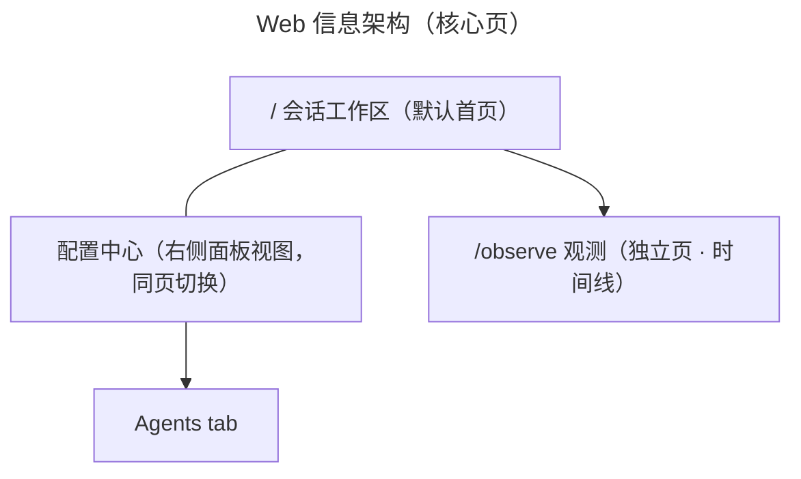

# Web 界面设计（页面清单）

> 所属项目：[Mira Code 设计文档](README.md) ｜ 表现层：[presentation.md](presentation.md)
> 状态：页面清单 v0.6 —— 会话工作区作为首页（mockup 已细化）；配置中心并入右侧面板视图（同页切换）；观测为独立页（时间线为主）
> 决策：#10 配置中心可视化编辑写回；#11 会话列表放侧边栏、不单独成页；#12 Agent 目录并入配置中心；#13 观测页后续规划；#15 会话工作区作为首页；#16 会话工作区布局（左侧概览 + 右侧会话）；#17-#22 UI mockup 细节

## 本期核心页面

| # | 页面 | 路由 | 一句话用途 |
|---|------|------|-----------|
| 1 | 会话工作区（默认首页） | `/`（深链 `/chat/:sessionId`） | 主交互页：左侧总体概览（工作区树）+ 右侧当前会话（消息流 + 悬浮输入栏）（决策 #15/#16） |
| 2 | 配置中心（右侧面板视图） | 无独立路由（与 `/` 同页切换） | tabs：General / Providers / Agents / MCP / Skills，可视化编辑写回（决策 #21） |
| 3 | 观测 | `/observe` | 独立页：会话列表 + 事件时间线 + 分派 span 树（决策 #22 修订） |
| 4 | 404 / 错误页 | `*` | 兜底 + 全局加载/错误态 |

## 规划中（M3 遥测完备后深化）

观测已是核心页（独立路由 `/observe`）；M3 后深化方向：真实指标源接入、多会话对比、聚合报表导出。

---

## 页面详情

### 1. 会话工作区 `/`（默认首页，决策 #15）

> 打开应用直接进入会话工作区；未选中会话时右面板显示**新建会话面板**。
> 可视化 mockup：`mockups/workspace.html`

```
┌───────────────────────────┬─────────────────────────────────────────┐
│ 左侧：总体概览              │ 右侧：当前 Session（一整块）                 │
│ ┌─────────────────────┐   │ ┌─────────────────────────────────────┐ │
│ │ M  Mira Code  ＋新建 ‹ │   │ │ 会话栏（仅标题）                      │ │
│ │ 工作区                │   │ ├─────────────────────────────────────┤ │
│ │ ▾ write_test  ＋ ⋯   │   │ │ 消息流（可滚动）                       │ │
│ │   · 会话…             │   │ │  · 用户消息 / agent 输出              │ │
│ │ ▸ mira-code  ＋ ⋯    │   │ │  · 工具卡片 / 子 agent 分派卡片        │ │
│ │ ▸ demo-app   ＋ ⋯    │   │ │                                     │ │
│ │                     │   │ │  ┌──────────────────────────────┐  │ │
│ │ ⚙（设置）            │   │ │  │ 悬浮输入栏（📎/审批/模式/模型/effort 🚀）│  │ │
│ └─────────────────────┘   │ │  └──────────────────────────────┘  │ │
│                       ⋮   │ └─────────────────────────────────────┘ │
└───────────────────────────┴─────────────────────────────────────────┘
```

**布局逻辑（决策 #16）**

- **左侧 = 总体概览**：Logo + **新建会话按钮** + 工作区树 + 页脚（**会话工作区 / 配置中心** 面板导航 + **观测** 独立页入口）；**无全局顶栏、无搜索按钮**。
- **右侧 = 当前会话**：**一整块面板**，自带**会话栏（仅标题）**；**输入栏悬浮在面板底部**（覆盖在消息区之上）。
- 两面板间有**拖拽条**（竖直居中三圆点）调整宽度（180–420px）。
- 未选中会话时右面板显示**新建会话空态**（见下）。

**新建会话空态（决策 #18）**

- 点击**「＋ 新建会话」**（Logo 区或工作区行「＋」）→ 右面板切换为居中空态：
  - 居中 Logo + **居中输入框**（含输入栏控件）
  - 输入框**下方扩展项**：工作区选择器（`write_test ▾`）
  - 点击侧边栏任意会话退出空态
- 参考 Kimi Code 的新会话样式。

**侧边栏 · 工作区树（决策 #11 修订 / #19）**
- 会话管理以**工作区为中心**：工作区默认以**文件夹名**命名，可展开查看该工作区下的会话列表；**无「进行中/历史」分组**。
- **悬停工作区行**显示操作图标：**＋**（该工作区新建会话）、**⋯**（更多 = 重命名 / 删除工作区）。
- **会话项**：**左缩进 + 层级引导线**（清晰归属工作区）；仅**当前选中会话**有浅色阴影（工作区/会话默认无背景色）；**悬停显示归档按钮**，点击归档后该会话不再展示。
- 点击会话切换 = 订阅切换 + 拉取会话快照；切换期间显示加载态。

**侧边栏折叠 / 展开**
- Logo 区 **‹ 收起**按钮折叠左侧面板；折叠后**右面板会话栏左侧出现 › 展开**按钮恢复。

**输入栏控件（决策 #17）**
- **📎 引用文件**（扁平图标）：索引 / 引用文件
- **自动通过 ▾**（棕色）：**审批层次**多级选择（自动通过 / 询问 / 拒绝）
- **模式 · main ▾**（蓝色）：选择 agent
- **gpt-4o ▾**（模型）、**high ▾**（effort，橙色）：**靠右**排列
- **发送**：**圆形图标按钮**（纸飞机 SVG）
- **模型与 effort 每回复必带**（决策 #25）：`POST /api/sessions/{id}/messages` 必须携带 `model`（前端每轮读取页面上的模型选择），`effort` 随之发送；同一会话不同轮可用不同模型，session 不绑定模型。

**视觉规范（决策 #20）**
- 图标一律使用**扁平 SVG**（不使用 emoji）
- 全局**禁止文字选中**（`user-select:none`）；消息区 / 输入框保持可选中（便于复制/编辑）

**消息流**
- 用户消息 / agent 流式输出（`agent.message.delta` 增量渲染）
- 工具调用卡片：工具名、参数、耗时、结果摘要、状态 ✓/✗
- 子 agent 分派卡片：谁分派给谁、`summary` 摘要、报告文件链接（可 `file_read` 查看详情）
- 错误提示（`error.raised`）

**审批弹窗（HITL）**
- 触发：输入栏「自动通过」审批层次设为「询问」时，`tool.call` 命中 `ask` 权限 → 弹窗
- 内容：工具名 + 参数预览 + 允许 / 拒绝 / 总是允许（对应 `approval.requested` / `approval.resolved`）

**连接可靠性**
- WebSocket 断线自动重连，按 `last_seq` 补发事件

### 3. 配置中心（右侧面板视图，决策 #10 修订 / #21）

> 配置中心**不是独立页面**，而是主页面（会话工作区）右侧面板的第二个视图：侧边栏页脚「配置中心」切换进入（「会话工作区」返回），复用同一侧边栏与视觉规范。
> 配置文件是真相源；页面编辑 → 校验（pydantic schema）→ **写回对应 TOML** → 热重载/提示重载。
> 可视化 mockup：`mockups/workspace.html`（与会话工作区同一文件，`body.settings-mode` 切换视图）

| Tab | 内容 |
| --- | --- |
| **General** | 会话默认（default_agent/model，模型为 `{provider}/{model}` 规格串）、`max_concurrent_sessions`、审批策略、遥测开关 |
| **Providers** | LLM 供应商列表 + 编辑（provider=type/base_url/api_key/timeout/max_retries）+ 测试连通性；**每种 provider 只允许一个配置，id 即 type**（决策 #26）；API key 为明文（决策 #8a） |
| **Agents** | 主/子 agent 定义（id/role/name/description/system_prompt/model/tools/skills/mcp/权限规则）+ 编辑 + **新增 agent**（配置即注册的 UI 入口）（决策 #12） |
| **MCP** | server 列表 + 编辑（transport/url/command/auth）+ 连接状态 + 暴露的工具清单 |
| **Skills** | skill 全局定义（id/name/description/prompt 模板）+ 关联 agent（与各 agent `[agents.skills]` 双向同步）+ 新增 skill |

> 模型选择统一为 `{provider}/{model}` 规格串（如 `deepseek/deepseek-chat`）：聊天输入栏模型弹窗按 provider 分组展示，选中即以该串发送；会话/CLI 均以该串指定模型（决策 #26）。

### 4. 观测 `/observe`（独立页，决策 #22 修订）

> 观测是**独立页面**（不共享主页右侧面板），**以时间线为核心**，不包含回放功能。
> 遥测数据源：JSONL 事件日志 + SQLite 指标投影（决策 #13 · 指标口径见 [data-models.md](data-models.md)）。
> 可视化 mockup：`mockups/observe.html`

**布局**
- 左侧复用同一侧边栏（页脚三导航，「观测」高亮为当前页）。
- 右侧主体：顶部时间范围（24h/7d/30d）+ 刷新；左侧**会话列表**（点击切换会话）；右侧**时间线主区**（会话信息条 + 双栏：事件时间线 + 分派 span 树）。
- 事件时间线按 taxonomy 着色（session/message/agent/task/tool/llm/error）；span 树展示 main → task.dispatch → agent.spawn… 层级。

### 4. 404 / 错误页 `*`

- 未匹配路由兜底页
- 全局错误 / 加载态组件

---

## 导航结构



> 实线 = 同页视图切换（配置中心）；箭头 = 页面跳转（观测独立页）。

## 全局共享组件（非页面）

- 侧边栏（工作区树）、会话状态徽标、工具调用卡片、审批弹窗、悬浮输入栏
- 全局 WS 事件流 hook（订阅指定 session、断线重连、快照补偿）
- 配置编辑表单组件（通用校验 + 写回 + 重载提示）
- 事件 JSON 查看器（观测页用）

## 与 CLI 的映射（预览）

CLI（Textual）将按同一 IA 映射为"视图/面板"：

| Web 页面 | CLI 视图/入口 |
| --- | --- |
| 会话工作区 `/`（默认首页） | 主对话视图（启动即进入：消息面板 + 输入 + 状态栏） |
| 新建会话（空态） | 新会话启动流程（选择工作区/agent） |
| 工作区树（侧边栏） | 会话切换（`:sessions` 或面板） |
| 工作区「⋯」（重命名/删除） | 斜杠命令（`:rename` `:rm` …） |
| 会话归档 | 斜杠命令（`:archive`） |
| 输入栏控件 | 状态栏/工具条（审批层次、模式、模型/effort） |
| 配置中心（右侧面板视图） | `:config` 命令 + 只读视图 |
| 观测（独立页） | `/observe` 命令 + 视图（时间线） |

两者消费同一 `EventStream` / REST API，页面与视图一一对应。
